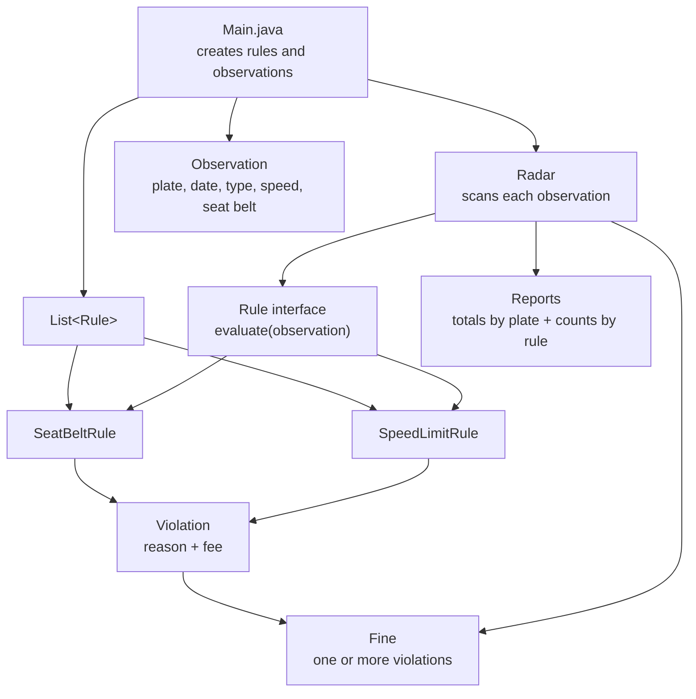

# Radar System

## Files

- `Main.java` - contains the whole program in one source file.
  - `Main` wires the rules and sample observations together.
  - `Observation` stores one radar reading (plate, date, car type, speed, seat belt).
  - `CarType` defines PRIVATE / TRUCK / BUS.
  - `Rule` is the interface every rule implements (`evaluate(Observation)` -> `Violation` or `null`).
  - `SeatBeltRule` and `SpeedLimitRule` are the two current rule implementations.
  - `Violation` stores a broken rule's reason and fee.
  - `Fine` groups one or more violations for a single observation.
  - `Radar` scans observations, creates fines, and keeps reports.

## Diagram



## Why it's extensible

`Radar` only depends on the `Rule` interface, not on any concrete rule. Adding a new rule (say, a license expiry check, or a speed limit for buses) means writing a new class that implements `Rule` and adding one line to the list in `Main` - the `Radar` class doesn't change.

## Run it

```
javac Main.java
java Main
```
