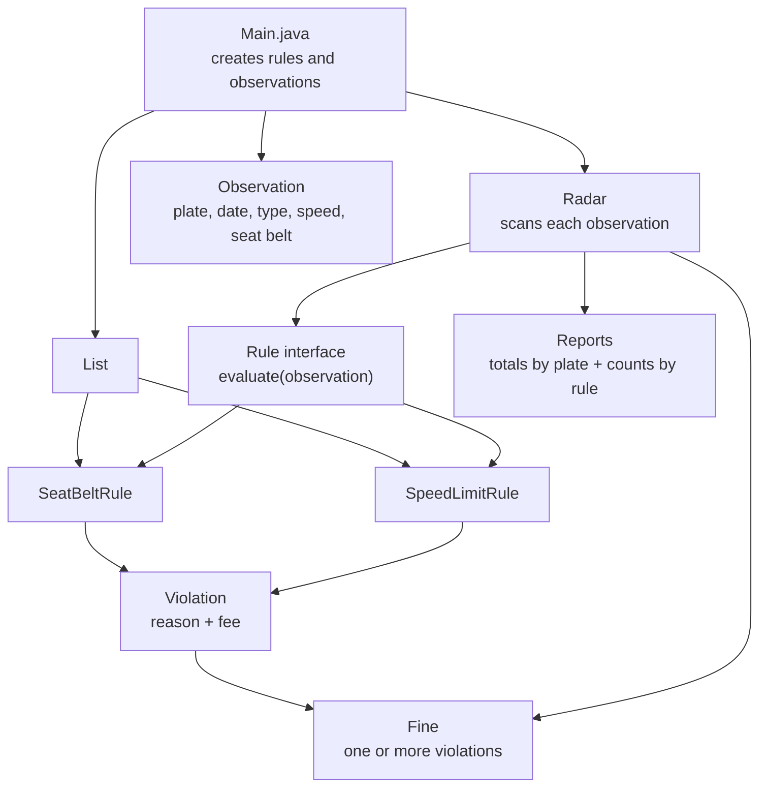

# Radar System

## Files

- `Observation.java` - one reading from the physical radar (plate, date, car type, speed, seat belt).
- `CarType.java` - PRIVATE / TRUCK / BUS.
- `Rule.java` - interface every rule implements (`evaluate(Observation)` -> `Violation` or `null`).
- `SeatBeltRule.java`, `SpeedLimitRule.java` - the two rules from the spec. `SpeedLimitRule` takes its car type, limit and fee in the constructor, so the same class covers Truck, Private, or any future car type.
- `Violation.java` - a broken rule: reason text + fee.
- `Fine.java` - one or more violations for a single observation, knows its total and how to print itself.
- `Radar.java` - runs an observation past its list of rules and turns any violations into a `Fine`. Also keeps a running total per plate and a count per rule. Has no idea what a speed limit or seat belt actually is - that logic lives entirely in the `Rule` classes.
- `Main.java` - wires it all together and runs a few sample observations through it.

## Diagram



## Why it's extensible

`Radar` only depends on the `Rule` interface, not on any concrete rule. Adding a new rule (say, a license expiry check, or a speed limit for buses) means writing a new class that implements `Rule` and adding one line to the list in `Main` - `Radar.java` doesn't change.

## Run it

```
javac *.java 
java Main
```
